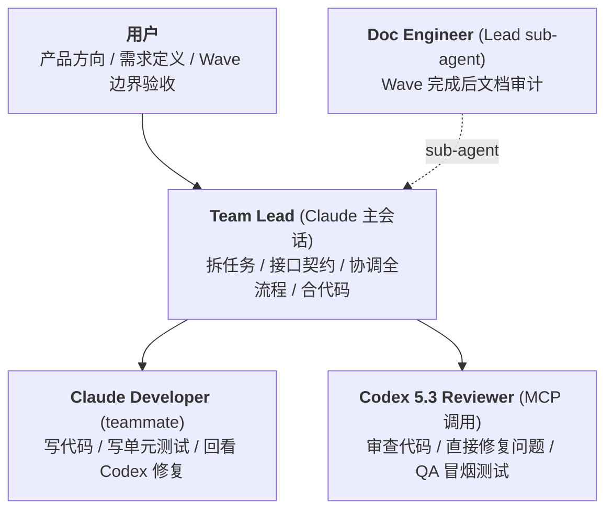

# iSparto

> 一个人种下种子，一支军队自己长出来。

用 Claude Code Agent Team 模式，让一个人拥有一支 AI 开发团队。
适用于所有软件开发项目（iOS / Android / macOS / Windows / Web / 跨平台）。

---

## 名字的由来

希腊神话里，英雄 Cadmus 杀了一条龙，把龙牙种进泥土。一支全副武装的战士从地里破土而出——他们被称为 **Spartoi**（Σπαρτοί），意为"播种而生的人"。

这和 iSparto 的工作流是同一个故事：你把产品需求"种"进 `/init-project`，一整支 Agent Team 自动组建——Lead 拆任务、Developer 写代码、Codex 审查修复、Doc Engineer 同步文档——从一颗种子长出一支完整的开发团队。

**i** 从 Spartoi 末尾移到了最前面。小写的 i = I = 我，一个人。

**iSparto = I + Sparto = 一人成军。**

---

## 角色架构



- Lead / Developer / Doc Engineer：**Claude Opus 4.6** + max effort
- Codex Reviewer：**Codex 5.3**（通过 MCP，走 $20 ChatGPT 订阅，xhigh reasoning + fast mode）

---

## 前置条件

| 项目 | 要求 | 说明 |
|------|------|------|
| Claude Max 订阅 | $100/月 | Claude Code + Agent Team 模式 |
| ChatGPT 订阅 | $20/月 | Codex CLI（代码审查 + QA） |
| Node.js | 18+ | 运行 Claude Code、Codex CLI 和 MCP Server |
| Git | 任意版本 | 版本控制 |
| 终端 | iTerm2（macOS） | Agent Team tmux 模式依赖 iTerm2 内置的 tmux 集成，无需单独安装 tmux |

**总成本：$120/月**，两个顶级模型（Claude Opus + Codex），无额外 API 费用。

---

## 安装

```bash
# 1. 安装 Claude Code（需要 Node.js 18+）
npm install -g @anthropic-ai/claude-code

# 2. 安装 Codex CLI
npm install -g @openai/codex

# 3. 用 ChatGPT 订阅账户登录 Codex
codex login

# 4. 把本仓库的命令和模板复制到用户目录
git clone https://github.com/BinaryHB0916/iSparto.git
cp -r iSparto/commands/ ~/.claude/commands/
cp iSparto/CLAUDE-TEMPLATE.md ~/.claude/CLAUDE-TEMPLATE.md
cp iSparto/settings.json ~/.claude/settings.json

# 5. 在你的项目里添加 Codex MCP Server（每个项目执行一次）
cd your-project/
claude mcp add codex-reviewer -s project -- npx -y codex-mcp-server

# 6. 重启 Claude Code，验证 MCP 连接
# 进入 Claude Code 后输入 /mcp，确认 codex-reviewer 状态为 ✓ connected
```

---

## 快速开始

<!-- TODO: 补充真实项目的使用示例和截图，展示从 /init-project 到 Agent Team 分屏并行的完整流程 -->

### 初始化新项目

```
1. 在任何地方讨论产品 idea，产出一份 rough 文档
2. 新建项目文件夹
3. 在 Claude Code 里执行 /init-project + 产品文档
4. Claude Code 生成 CLAUDE.md + docs/（product-spec、tech-spec、design-spec、plan）
5. 检查确认，开工
```

### 每天的工作循环

```
/start-working
    → Lead 读取 plan.md，告诉你当前状态和待办
    → 你确认"开始"
        ↓
Lead 团队自己跑（你不用盯着）
    → 拆任务 → Developer 写代码 → Codex 审查 → Developer 回看
    → Codex QA → Doc Engineer 文档审计 → Lead 合代码
        ↓
偶尔 Lead 来找你（上报决策 / 确认 commit）
        ↓
/end-working
    → 同步文档 → 更新 plan.md → commit → push
```

### 有新需求时

```
/plan 我想加一个xxx功能
    → Lead 先审视产品方向，输出方案
    → 你确认方案后，Lead 把方案写入 plan.md 再开始
```

---

## 启动清单

- [ ] Claude Max + ChatGPT 订阅已开通
- [ ] 终端使用 iTerm2（macOS，内置 tmux 集成，Agent Team 分屏依赖）
- [ ] Codex CLI 已安装并登录（`npm i -g @openai/codex && codex login`）
- [ ] `~/.claude/` 下的 settings.json、CLAUDE-TEMPLATE.md、commands/ 已就位
- [ ] 多设备同步已配置（如有多台电脑）
- [ ] 项目级 Codex MCP Server 已添加（`/mcp` 验证 ✓ connected）
- [ ] 项目级 `.claude/settings.json` 配置平台相关插件（如 iOS 加 swift-lsp）
- [ ] 项目 CLAUDE.md 已通过 `/init-project` 生成，包含协作模式 + 模块边界 + 分支策略
- [ ] 项目 docs/plan.md 按 Wave 模板组织
- [ ] 项目 docs/tech-spec.md 按模板创建（如有技术架构）
- [ ] 项目 docs/design-spec.md 按模板创建（如有 UI）
- [ ] 启动用 `claude --effort max`

---

## 仓库结构

```
iSparto/
├── README.md                  ← 你正在读的这份文档
├── settings.json              ← Claude Code 全局配置
├── CLAUDE-TEMPLATE.md         ← 新项目 CLAUDE.md 生成模板
├── LICENSE
├── commands/
│   ├── start-working.md       ← 开工命令
│   ├── end-working.md         ← 收工命令
│   ├── plan.md                ← 出方案命令
│   └── init-project.md        ← 初始化项目命令
├── templates/
│   ├── product-spec-template.md
│   ├── tech-spec-template.md
│   ├── design-spec-template.md
│   └── plan-template.md
└── docs/                      ← 详细文档
    ├── concepts.md            ← 核心概念（解耦、Wave、文件所有权）
    ├── user-guide.md          ← 用户交互手册（4 命令 + 3 通知）
    ├── roles.md               ← 角色定义（Lead、Developer、Codex、Doc Engineer 完整指令）
    ├── workflow.md            ← 完整开发流程 + 分支策略 + Codex 集成
    ├── configuration.md       ← 全局配置 + 文档规范 + 适配指南 + 多设备同步
    ├── troubleshooting.md     ← 常见问题排查
    └── design-decisions.md    ← 设计决策记录
```

---

## 详细文档

| 文档 | 内容 |
|------|------|
| [核心概念](docs/concepts.md) | 解耦、Wave、文件所有权、接口契约、tmux teammate 模式 |
| [用户交互手册](docs/user-guide.md) | 你要做什么、不需要做什么、重点关注什么 |
| [角色定义](docs/roles.md) | Lead、Developer、Codex Reviewer、Doc Engineer 的完整指令和 prompt 模板 |
| [完整开发流程](docs/workflow.md) | Phase 0 初始化 → Phase 1-N Wave 并行开发 → 分支策略 → Codex 集成 → 自定义命令 |
| [配置与适配](docs/configuration.md) | settings.json、文档命名规范、适配指南、Memory 边界、多设备同步 |
| [常见问题排查](docs/troubleshooting.md) | MCP 连接、上下文溢出、文件冲突、会话恢复等 |
| [设计决策记录](docs/design-decisions.md) | 每个设计选择的"为什么" |

---

## License

[MIT](LICENSE)
