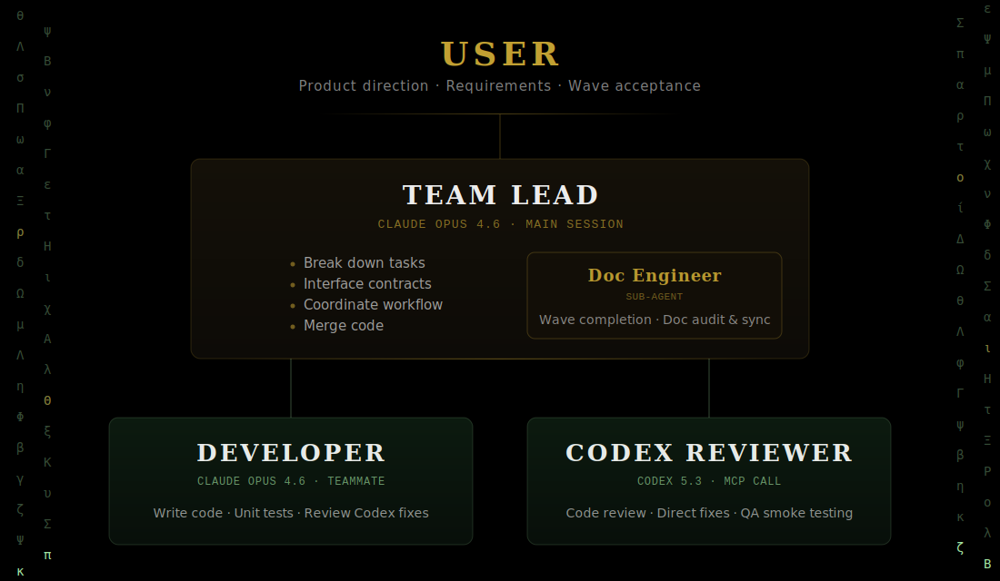

<p align="center">
  
</p>

<p align="center">
  <a href="README.zh-CN.md">中文版</a>
</p>

---

**iSparto is an open-source Agent Team framework for Claude Code — built for solopreneurs.** One command spins up the whole agent team — all working in perfect sync. You direct the team through the Team Lead; the rest runs in the background.

> **中文用户** can start from [docs/zh/quick-start.md](docs/zh/quick-start.md) — a Chinese quick-start covering install, first use, and the daily workflow.
>
> iSparto uses a deliberate bilingual strategy: user-facing entries (both READMEs + the Chinese quick-start + `CONTRIBUTING.md`) are maintained in parallel; framework instructions and reference documentation are English-only as a single source of truth, so AI instruction-following stays stable and non-Chinese-speaking contributors can review the framework. See [CLAUDE.md > Documentation Language Convention](CLAUDE.md#documentation-language-convention) for the full rationale.

### The core idea — one command, the whole team

Every existing AI coding tool — Cursor, Windsurf, Copilot, Claude Code on its own — puts you in a loop with a single agent. You and it trade messages for every decision, every file, every commit. The whole development cycle runs through one conversation window.

iSparto's central move is to turn that single agent into an Agent Team. One command (`/init-project` or `/start-working`) spins up the whole agent team — six roles in parallel: Team Lead plans and coordinates, Teammate writes code, Independent Reviewer audits with fresh context, Developer implements via Codex, Doc Engineer keeps documentation synced, Process Observer guards the workflow. You direct the team through the Team Lead; the rest stays out of your way until a decision is actually needed.

|  | Single-agent tools | iSparto |
|--|---|---|
| What you see | Everything the agent just read, reconstructed in prose | The one line the Team Lead decides you need; the rest lives in `docs/` |
| When you are interrupted | Whenever the agent has something to say | Only at genuine decision points |
| Cross-session state | Lost — you re-explain context every time | Restored automatically from `docs/plan.md` at session start |
| Documentation sync | Manual | Audited every Wave by the Doc Engineer |

### Who this is for

Solopreneurs shipping software on macOS who want to run a full agent team on top of Claude Code. Requires Claude Max and ChatGPT subscriptions.

> **Platform: macOS only.** Parallel-execution mode relies on iTerm2's built-in tmux integration. Single-session mode may work on other platforms but is untested.

| Item | Requirement | Notes |
|---|---|---|
| Claude Max subscription | $100/month | Runs Claude Code and the lead/teammate/doc-engineer roles |
| ChatGPT subscription | $20/month | Runs the Codex CLI used by the developer role |
| Node.js | 18+ | Runs Claude Code, Codex CLI, and the MCP Server |
| Git | Any version | Version control |
| Terminal | iTerm2 (macOS) | Parallel-execution mode uses iTerm2's built-in tmux integration; no separate tmux install |

**Total cost: $120/month** — two top-tier models, no extra API fees.

---

## Installation

**Prerequisites:** [Claude Max](https://claude.ai) ($100/mo) + [ChatGPT Plus](https://chatgpt.com) ($20/mo). iSparto runs on Claude Code as the runtime and uses the Codex CLI for the developer role.

```bash
curl -fsSL https://raw.githubusercontent.com/BinaryHB0916/iSparto/main/bootstrap.sh | bash
```

One command handles everything: downloads a verified installer from GitHub Releases, checks and installs Claude Code and the Codex CLI, logs into Codex, copies commands and templates to `~/.claude/`, and registers the global MCP Server. Your existing `~/.claude/settings.json` is never modified. A snapshot of your original files is automatically taken before any changes, so you can always revert.

**Preview before installing:**

```bash
curl -fsSL https://raw.githubusercontent.com/BinaryHB0916/iSparto/main/bootstrap.sh | bash -s -- --dry-run
```

**Install a specific version:**

```bash
curl -fsSL https://raw.githubusercontent.com/BinaryHB0916/iSparto/main/bootstrap.sh | bash -s -- --version=0.6.18
```

**Upgrade:**

```bash
~/.isparto/install.sh --upgrade
```

> Upgrade updates framework components only (commands, templates, snapshot engine). Your project files (CLAUDE.md, docs/, code, settings) are never touched.

**Uninstall:** reverts all changes and restores your original files from the backup snapshot, works offline:

```bash
~/.isparto/install.sh --uninstall
```

Having trouble? See [Troubleshooting](docs/troubleshooting.md).

<details>
<summary>Alternative: manual clone</summary>

```bash
git clone https://github.com/BinaryHB0916/iSparto.git
cd iSparto && ./install.sh              # or: ./install.sh --dry-run
```
</details>

---

## Quick Start

### Initialize a new project

```bash
mkdir my-app && cd my-app
claude --effort max
/env-nogo                              # optional environment check
/init-project I want to build an xxx   # generates CLAUDE.md + docs/ + architecture pre-review
```

A snapshot is taken before any files are created. If anything goes wrong, run `/restore` to roll back.

### Migrate an existing project

```bash
cd existing-project/
claude --effort max
/migrate --dry-run        # preview migration plan without executing (recommended first run)
/migrate                  # scans project, proposes migration plan, preserves existing content
```

A snapshot is taken before any changes. Run `/restore` at any time to roll back.

### Daily work cycle

```
/start-working
    → Lead reads plan.md, reports current status and remaining work
    → You confirm "go ahead"
        ↓
The team runs on its own — you do not need to watch
    → Tasks are broken down, code is written and cross-reviewed, docs audited
        ↓
The lead only comes back to you at genuine decision points
        ↓
/end-working
    → Sync docs → update plan.md → commit → push
```

### When you have new requirements

```
/plan I want to add an xxx feature
    → Lead reviews product direction, produces one proposal
    → After you confirm, Lead writes it into plan.md and begins work
```

---

## Role Architecture

<p align="center">
  
</p>

The agent team has six roles:

- **Team Lead** — the one you talk to. Plans tasks, coordinates the team, and escalates only when a decision is actually needed.
- **Teammate** — parallel Claude session that takes on work the Team Lead delegates. Runs in its own tmux pane.
- **Independent Reviewer** — spawned with zero inherited context at review time, so it cannot rubber-stamp decisions it helped make.
- **Developer** — implementation specialist, invoked via MCP (Codex). Receives specs from the Team Lead, returns code.
- **Doc Engineer** — audits documentation at every Wave boundary.
- **Process Observer** — a PreToolUse hook (shell, no model) that blocks ceremonial steps from being skipped, plus an advisory Sonnet audit layer.

Full model assignments and reasoning levels live in [docs/configuration.md](docs/configuration.md#agent-model-configuration). Security oversight (Write/Edit scanning, pre-commit secret/PII checks, `/security-audit`) is documented in [docs/security.md](docs/security.md).

---

## Case Studies

iSparto dogfoods itself — the framework is developed using its own workflow. End-to-end case studies live in a dedicated file: see [docs/case-studies.md](docs/case-studies.md), starting with the Session Log self-bootstrapping run that used the workflow to build its own session-metrics feature.

## Dogfood Log

Subjective session-by-session notes on whether the framework actually runs in sync in practice live in [docs/dogfood-log.md](docs/dogfood-log.md). This is the evidence-chain companion to the value prop on this page.

## Repository Structure

The full repository layout, annotated per file, is maintained in [docs/repo-structure.md](docs/repo-structure.md). The README used to embed the tree inline; it is now kept in its own file so structural changes do not churn the README with every Wave.

---

## Getting Started Checklist

**One-time setup (`./install.sh` handles this automatically):**

- [ ] Claude Max + ChatGPT subscriptions active
- [ ] Terminal is iTerm2 (macOS, required for parallel-execution split panes)
- [ ] `./install.sh` completed (Claude Code, Codex CLI, config files, MCP)
- [ ] Multi-device sync configured if using multiple computers (see [configuration.md](docs/configuration.md#multi-device-sync-optional))

**Each new project (`/init-project` handles this automatically):**

- [ ] Launch with `claude --effort max`
- [ ] `/env-nogo` check passed (optional)
- [ ] `/init-project` has generated CLAUDE.md + docs/
- [ ] Project-level `.claude/settings.json` configured with platform-specific plugins (optional)

---

## Origin of the Name

In Greek mythology, the hero Cadmus slew a dragon and sowed its teeth into the earth. A host of fully armed warriors sprang from the ground — they were called **Spartoi** (Σπαρτοί), meaning "the sown ones."

This is the same story as iSparto's workflow: you sow your product requirements into `/init-project`, and a whole team assembles itself — lead breaks down tasks, developer writes code, reviews land in the same Wave, documentation stays in sync — a complete team grown from a single seed.

The **i** was moved from the end of Spartoi to the front. Lowercase i = I = me, one person.

**iSparto = I + Sparto = one-person army.**

---

## License

[MIT](LICENSE)
