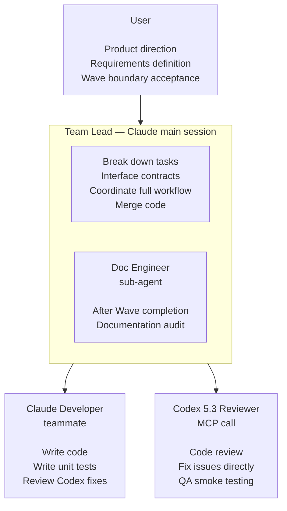

# iSparto

[中文版](README.zh-CN.md)

Use Claude Code Agent Team mode to give one person a full AI development team.
Works for all software development projects (iOS / Android / macOS / Windows / Web / cross-platform).

---

## Origin of the Name

In Greek mythology, the hero Cadmus slew a dragon and sowed its teeth into the earth. A host of fully armed warriors sprang from the ground — they were called **Spartoi** (Σπαρτοί), meaning "the sown ones."

This is the same story as iSparto's workflow: you sow your product requirements into `/init-project`, and an entire Agent Team assembles itself — Lead breaks down tasks, Developer writes code, Codex reviews and fixes, Doc Engineer keeps documentation in sync — a complete development team grown from a single seed.

The **i** was moved from the end of Spartoi to the front. Lowercase i = I = me, one person.

**iSparto = I + Sparto = one-person army.**

---

## Role Architecture



- Lead / Developer / Doc Engineer: **Claude Opus 4.6** + max effort
- Codex Reviewer: **Codex 5.3** (via MCP, using $20 ChatGPT subscription, xhigh reasoning + fast mode)

---

## How iSparto Differs from Existing Tools

Existing AI coding tools (Cursor, Windsurf, Copilot, Claude Code single session) all follow the same pattern — **you go back and forth with a single Agent**. The Agent has no team, no division of labor; everything depends on you and it trading messages back and forth.

iSparto turns a single Agent into **a team with clear roles**: Lead breaks down tasks, Developers write code in parallel, Codex cross-reviews, and Doc Engineer keeps documentation in sync. Instead of directing an Agent line by line, you confirm the direction and accept the results.

| | Single-Agent Tools | iSparto |
|--|---------------------|---------|
| Collaboration mode | You go back and forth with a single Agent | You work with the Lead; Lead coordinates the whole team |
| AI organization | Single Agent, no division of labor | Team-based (Lead + Developer + Reviewer + Doc Engineer) |
| Parallelism | None — single-threaded conversation | Multiple Developers in parallel within a Wave, visible via tmux split panes |
| Code review | Agent reviews its own code (same source) | Codex reviews Claude (different source), covering each model's blind spots |
| Cross-session state | Lost — must re-explain context every time | Driven by plan.md; `/start-working` auto-restores state |
| Documentation sync | Manual maintenance | Doc Engineer auto-audits every Wave |

**In short: other tools have you directing one Agent. iSparto has you directing an entire team.**

---

## Prerequisites

| Item | Requirement | Notes |
|------|-------------|-------|
| Claude Max subscription | $100/month | Claude Code + Agent Team mode |
| ChatGPT subscription | $20/month | Codex CLI (code review + QA) |
| Node.js | 18+ | Runs Claude Code, Codex CLI, and MCP Server |
| Git | Any version | Version control |
| Terminal | iTerm2 (macOS) | Agent Team tmux mode relies on iTerm2's built-in tmux integration; no separate tmux installation needed |

**Total cost: $120/month** — two top-tier models (Claude Opus + Codex), no additional API fees.

---

## Installation

```bash
curl -fsSL https://raw.githubusercontent.com/BinaryHB0916/iSparto/main/install.sh | bash
```

One command handles everything: downloads iSparto to `~/.isparto`, checks/installs Claude Code and Codex CLI, logs into Codex, copies configuration to `~/.claude/`, and registers the global MCP Server.

<details>
<summary>Alternative: manual clone</summary>

```bash
git clone https://github.com/BinaryHB0916/iSparto.git
cd iSparto && ./install.sh
```
</details>

---

## Quick Start

<!-- TODO: Add real project usage examples and screenshots showing the complete flow from /init-project to Agent Team split-pane parallel execution -->

### Initialize a New Project

```bash
mkdir my-app && cd my-app
claude --effort max
/env-nogo                        # optional — confirm environment readiness
/init-project I want to build an xxx   # generates CLAUDE.md + docs/, Codex architecture pre-review
```

### Migrate an Existing Project

```bash
cd existing-project/
claude --effort max
/migrate                         # scans project, proposes migration plan, preserves all existing content
```

### Daily Work Cycle

```
/start-working
    → Lead reads plan.md, reports current status and TODOs
    → You confirm "go ahead"
        ↓
Lead's team runs on its own (you don't need to watch)
    → Break down tasks → Developer writes code → Codex reviews → Developer reviews fixes
    → Codex QA → Doc Engineer documentation audit → Lead merges code
        ↓
Occasionally Lead comes to you (escalate decisions / confirm commits)
        ↓
/end-working
    → Sync documentation → Update plan.md → commit → push
```

### When You Have New Requirements

```
/plan I want to add an xxx feature
    → Lead first reviews the product direction, produces a proposal
    → After you confirm the proposal, Lead writes it into plan.md and begins work
```

---

## Getting Started Checklist

**One-time setup (`./install.sh` handles this automatically):**

- [ ] Claude Max + ChatGPT subscriptions active
- [ ] Terminal is iTerm2 (macOS, required for Agent Team split panes)
- [ ] `./install.sh` completed (Claude Code, Codex CLI, config files, MCP)
- [ ] Multi-device sync configured (if using multiple computers, see [configuration.md](docs/configuration.md#multi-device-sync-optional))

**Each new project (`/init-project` handles this automatically):**

- [ ] Launch with `claude --effort max`
- [ ] `/env-nogo` check passed (optional)
- [ ] `/init-project` has generated CLAUDE.md + docs/
- [ ] Project-level `.claude/settings.json` configured with platform-specific plugins (e.g., swift-lsp for iOS, optional)

---

## Repository Structure and Documentation Index

```
iSparto/
├── README.md                  ← The document you are reading now
├── settings.json              ← Claude Code global configuration
├── CLAUDE-TEMPLATE.md         ← Template for generating new project CLAUDE.md
├── LICENSE
├── .gitignore
├── install.sh                 ← One-click install script
├── commands/
│   ├── start-working.md       ← Start working command
│   ├── end-working.md         ← End working command
│   ├── plan.md                ← Planning command
│   ├── init-project.md        ← Initialize project command
│   ├── env-nogo.md            ← Environment readiness check
│   └── migrate.md             ← Migrate existing project to iSparto
├── templates/
│   ├── product-spec-template.md
│   ├── tech-spec-template.md
│   ├── design-spec-template.md
│   └── plan-template.md
└── docs/
    ├── concepts.md            ← Core concepts (decoupling, Wave, file ownership) ⭐ Recommended reading
    ├── user-guide.md          ← User interaction guide (6 commands + 3 notifications) ⭐ Recommended reading
    ├── roles.md               ← Role definitions + Codex prompt templates
    ├── workflow.md            ← Full development workflow + branching strategy + Codex integration
    ├── configuration.md       ← Global configuration + adaptation guide + multi-device sync
    ├── troubleshooting.md     ← Common troubleshooting
    └── design-decisions.md    ← Design decision records
```

---

## License

[MIT](LICENSE)
