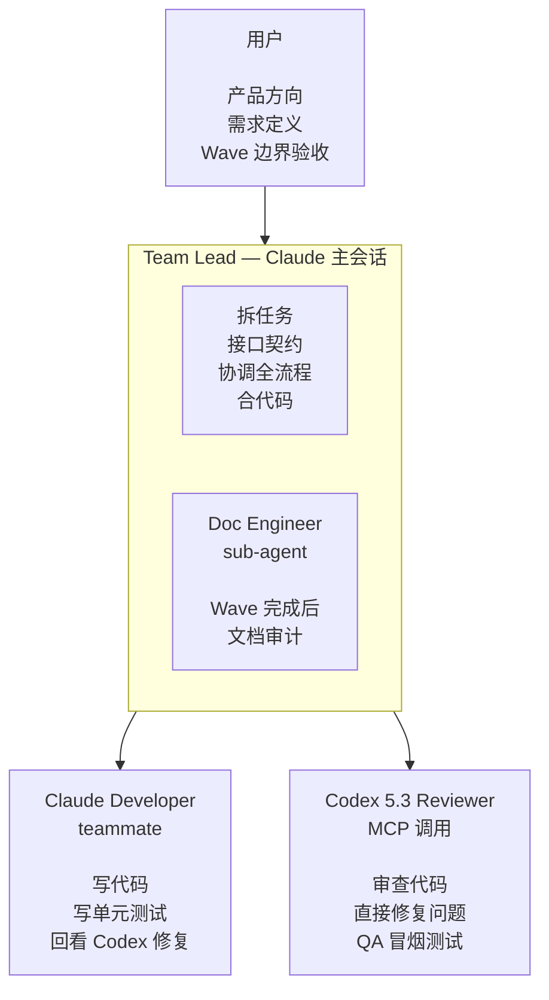

# iSparto

用 Claude Code Agent Team 模式，让一个人拥有一支 AI 开发团队。
适用于所有软件开发项目（iOS / Android / macOS / Windows / Web / 跨平台）。

---

## 名字的由来

希腊神话里，英雄 Cadmus 杀了一条龙，把龙牙种进泥土。一支全副武装的战士从地里破土而出——他们被称为 **Spartoi**（Σπαρτοί），意为"播种而生的人"。

这和 iSparto 的工作流是同一个故事：你把产品需求"种"进 `/init-project`，一整支 Agent Team 自动组建——Lead 拆任务、Developer 写代码、Codex 审查修复、Doc Engineer 同步文档——从一颗种子长出一支完整的开发团队。

**i** 从 Spartoi 末尾移到了最前面。小写的 i = I = 我，一个人。

**iSparto = I + Sparto = 一人成军。**

---

## 角色架构



- Lead / Developer / Doc Engineer：**Claude Opus 4.6** + max effort
- Codex Reviewer：**Codex 5.3**（通过 MCP，走 $20 ChatGPT 订阅，xhigh reasoning + fast mode）

---

## 和现有工具的区别

现有的 AI 编程工具（Cursor、Windsurf、Copilot、Claude Code 单会话）都是**你和一个 Agent 反复沟通**——Agent 没有团队，没有分工，所有事情都靠你和它一来一回地推进。

iSparto 把单个 Agent 变成**一支有分工的团队**：Lead 拆任务、Developer 并行写代码、Codex 交叉审查、Doc Engineer 同步文档。你不再逐句指挥 Agent，而是确认方向和验收结果。

| | 单 Agent 工具 | iSparto |
|--|--------------|---------|
| 协作模式 | 你和一个 Agent 反复沟通 | 你对接 Lead，Lead 协调整个团队 |
| AI 的组织 | 单个 Agent，无分工 | 团队化（Lead + Developer + Reviewer + Doc Engineer） |
| 并行能力 | 无，单线程对话 | Wave 内多 Developer 并行，tmux 分屏可视 |
| 代码审查 | 自己审自己（同源） | Codex 审 Claude（异源），覆盖不同模型的盲区 |
| 跨会话状态 | 丢失，每次重新解释上下文 | plan.md 驱动，`/start-working` 自动恢复 |
| 文档同步 | 手动维护 | Doc Engineer 每个 Wave 自动审计 |

**简单说：其他工具是你指挥一个 Agent，iSparto 是你指挥一支团队。**

---

## 前置条件

| 项目 | 要求 | 说明 |
|------|------|------|
| Claude Max 订阅 | $100/月 | Claude Code + Agent Team 模式 |
| ChatGPT 订阅 | $20/月 | Codex CLI（代码审查 + QA） |
| Node.js | 18+ | 运行 Claude Code、Codex CLI 和 MCP Server |
| Git | 任意版本 | 版本控制 |
| 终端 | iTerm2（macOS） | Agent Team tmux 模式依赖 iTerm2 内置的 tmux 集成，无需单独安装 tmux |

**总成本：$120/月**，两个顶级模型（Claude Opus + Codex），无额外 API 费用。

---

## 安装

```bash
curl -fsSL https://raw.githubusercontent.com/BinaryHB0916/iSparto/main/install.sh | bash
```

一行搞定：下载 iSparto 到 `~/.isparto`、检查/安装 Claude Code 和 Codex CLI、登录 Codex、复制配置到 `~/.claude/`、注册全局 MCP Server。

<details>
<summary>备选：手动 clone</summary>

```bash
git clone https://github.com/BinaryHB0916/iSparto.git
cd iSparto && ./install.sh
```
</details>

---

## 快速开始

<!-- TODO: 补充真实项目的使用示例和截图，展示从 /init-project 到 Agent Team 分屏并行的完整流程 -->

### 初始化新项目

```bash
mkdir my-app && cd my-app
claude --effort max
/env-nogo                        # 可选，确认环境就绪
/init-project 我要做一个xxx       # 生成 CLAUDE.md + docs/，Codex 架构审视
```

### 迁移已有项目

```bash
cd existing-project/
claude --effort max
/migrate                         # 扫描项目，出迁移方案，保留所有现有内容
```

### 每天的工作循环

```
/start-working
    → Lead 读取 plan.md，告诉你当前状态和待办
    → 你确认"开始"
        ↓
Lead 团队自己跑（你不用盯着）
    → 拆任务 → Developer 写代码 → Codex 审查 → Developer 回看
    → Codex QA → Doc Engineer 文档审计 → Lead 合代码
        ↓
偶尔 Lead 来找你（上报决策 / 确认 commit）
        ↓
/end-working
    → 同步文档 → 更新 plan.md → commit → push
```

### 有新需求时

```
/plan 我想加一个xxx功能
    → Lead 先审视产品方向，输出方案
    → 你确认方案后，Lead 把方案写入 plan.md 再开始
```

---

## 启动清单

**一次性安装（`./install.sh` 自动完成）：**

- [ ] Claude Max + ChatGPT 订阅已开通
- [ ] 终端使用 iTerm2（macOS，Agent Team 分屏依赖）
- [ ] `./install.sh` 已执行（Claude Code、Codex CLI、配置文件、MCP）
- [ ] 多设备同步已配置（如有多台电脑，见 [configuration.md](docs/configuration.md#多设备同步可选)）

**每个新项目（`/init-project` 自动完成）：**

- [ ] `claude --effort max` 启动
- [ ] `/env-nogo` 检查通过（可选）
- [ ] `/init-project` 已生成 CLAUDE.md + docs/
- [ ] 项目级 `.claude/settings.json` 配置平台相关插件（如 iOS 加 swift-lsp，可选）

---

## 仓库结构与文档索引

```
iSparto/
├── README.md                  ← 你正在读的这份文档
├── settings.json              ← Claude Code 全局配置
├── CLAUDE-TEMPLATE.md         ← 新项目 CLAUDE.md 生成模板
├── LICENSE
├── .gitignore
├── install.sh                 ← 一键安装脚本
├── commands/
│   ├── start-working.md       ← 开工命令
│   ├── end-working.md         ← 收工命令
│   ├── plan.md                ← 出方案命令
│   ├── init-project.md        ← 初始化项目命令
│   ├── env-nogo.md            ← 环境就绪检查
│   └── migrate.md             ← 迁移已有项目到 iSparto
├── templates/
│   ├── product-spec-template.md
│   ├── tech-spec-template.md
│   ├── design-spec-template.md
│   └── plan-template.md
└── docs/
    ├── concepts.md            ← 核心概念（解耦、Wave、文件所有权）⭐ 建议先读
    ├── user-guide.md          ← 用户交互手册（6 命令 + 3 通知）⭐ 建议先读
    ├── roles.md               ← 角色定义 + Codex prompt 模板
    ├── workflow.md            ← 完整开发流程 + 分支策略 + Codex 集成
    ├── configuration.md       ← 全局配置 + 适配指南 + 多设备同步
    ├── troubleshooting.md     ← 常见问题排查
    └── design-decisions.md    ← 设计决策记录
```

---

## License

[MIT](LICENSE)
