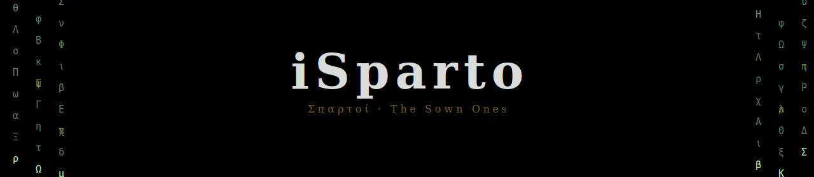
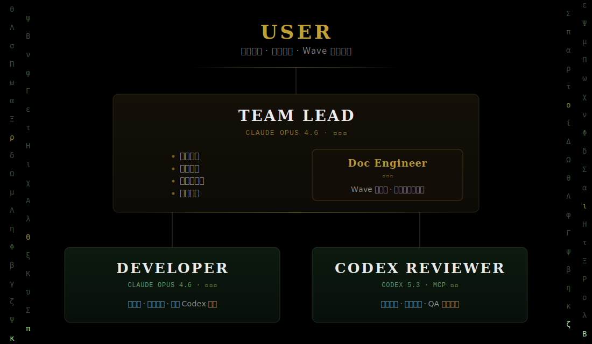

<p align="center">
  
</p>

<p align="center">
  <a href="README.md">English</a>
</p>

---

## 名字的由来

希腊神话里，英雄 Cadmus 杀了一条龙，把龙牙种进泥土。一支全副武装的战士从地里破土而出——他们被称为 **Spartoi**（Σπαρτοί），意为"播种而生的人"。

这和 iSparto 的工作流是同一个故事：你把产品需求"种"进 `/init-project`，一整支 Agent Team 自动组建——Lead 拆任务、Developer 写代码、Codex 审查修复、Doc Engineer 同步文档——从一颗种子长出一支完整的开发团队。

**i** 从 Spartoi 末尾移到了最前面。小写的 i = I = 我，一个人。

**iSparto = I + Sparto = 一人成军。**

---

## 角色架构

<p align="center">
  
</p>

- Lead / Developer / Doc Engineer：**Claude Opus 4.6** + max effort
- Codex Reviewer：**Codex 5.3**（通过 MCP，走 $20 ChatGPT 订阅，最高推理强度）

---

## 和现有工具的区别

现有的 AI 编程工具（Cursor、Windsurf、Copilot、Claude Code 单会话）都是**你和一个 Agent 反复沟通**——Agent 没有团队，没有分工，所有事情都靠你和它一来一回地推进。

iSparto 把单个 Agent 变成**一支有分工的团队**：Lead 拆任务、Developer 并行写代码、Codex 交叉审查、Doc Engineer 同步文档。你不再逐句指挥 Agent，而是确认方向和验收结果。

| | 单 Agent 工具 | iSparto |
|--|--------------|---------|
| 协作模式 | 你和一个 Agent 反复沟通 | Lead 自动选择：小任务 Solo + Codex，并行任务 Agent Team |
| AI 的组织 | 单个 Agent，无分工 | 团队化（Lead + Developer + Reviewer + Doc Engineer） |
| 并行能力 | 无，单线程对话 | Solo 模式（默认）处理小任务；Agent Team 模式 Wave 内并行执行 |
| 代码审查 | 自己审自己（同源） | Codex 审 Claude（异源），覆盖不同模型的盲区 |
| 跨会话状态 | 丢失，每次重新解释上下文 | plan.md 驱动，`/start-working` 自动恢复 |
| 文档同步 | 手动维护 | Doc Engineer 每个 Wave 自动审计 |

**简单说：其他工具是你指挥一个 Agent，iSparto 是你指挥一支团队。**

---

## 前置条件

> **平台：仅支持 macOS。** Agent Team 模式依赖 iTerm2 内置的 tmux 集成。Solo + Codex 模式在其他平台上可能可用，但未经测试。

| 项目 | 要求 | 说明 |
|------|------|------|
| Claude Max 订阅 | $100/月 | Claude Code + Auto 模式（Solo + Codex / Agent Team） |
| ChatGPT 订阅 | $20/月 | Codex CLI（代码审查 + QA） |
| Node.js | 18+ | 运行 Claude Code、Codex CLI 和 MCP Server |
| Git | 任意版本 | 版本控制 |
| 终端 | iTerm2（macOS） | Agent Team tmux 模式依赖 iTerm2 内置的 tmux 集成，无需单独安装 tmux |

**总成本：$120/月**，两个顶级模型（Claude Opus + Codex），无额外 API 费用。

---

## 安装

```bash
curl -fsSL https://raw.githubusercontent.com/BinaryHB0916/iSparto/main/bootstrap.sh | bash
```

一行搞定：从 GitHub Releases 下载经过校验的安装器、检查/安装 Claude Code 和 Codex CLI、登录 Codex、复制命令和模板到 `~/.claude/`、注册全局 MCP Server。不会修改你现有的 `~/.claude/settings.json`。安装前会自动对原始文件拍快照，随时可以回滚到安装前的状态。

**安装前先预览：** 加 `--dry-run` 可以看到会发生什么，但不执行任何变更：

```bash
curl -fsSL https://raw.githubusercontent.com/BinaryHB0916/iSparto/main/bootstrap.sh | bash -s -- --dry-run
```

**安装指定版本：**

```bash
curl -fsSL https://raw.githubusercontent.com/BinaryHB0916/iSparto/main/bootstrap.sh | bash -s -- --version=0.3.0
```

**升级：** 重新运行拉取最新版本，查看更新内容：

```bash
~/.isparto/install.sh --upgrade
```

> 升级只更新框架组件（命令模板、文档模板、快照引擎）。你的项目文件（CLAUDE.md、docs/、代码、配置）不会被修改。

**卸载：** 从备份快照还原所有被修改的文件（离线可用）：

```bash
~/.isparto/install.sh --uninstall
```

<details>
<summary>备选：手动 clone</summary>

```bash
git clone https://github.com/BinaryHB0916/iSparto.git
cd iSparto && ./install.sh              # 或: ./install.sh --dry-run
```
</details>

---

## 实测案例

**自举案例：iSparto 用自己的工作流开发自己的功能**

iSparto 的 "Session Log 自动采集" 功能（`/end-working` 自动生成 session report，`/start-working` 自动读取历史）完全由 iSparto 自己的 Agent Team 工作流开发完成。以下是实际执行流程。

**执行流程：**

1. `/start-working` — Lead 读取 plan.md，报告 Wave 5 状态，确定 session log 为下一个任务
2. Lead 建 `feat/session-log` 分支
3. Lead 拆任务 + 定义文件所有权：
   - Developer A：`commands/end-working.md`（加 session report 生成）
   - Developer B：`commands/start-working.md`（加 session log 读取）
4. 2 个 Developer 并行开发 — 同时完成各自任务
5. Codex Review — 发现 2 个 P2 问题：
   - `git diff --stat` 漏掉已暂存/新文件 → 改为 `git diff HEAD --stat`
   - diff 输出放 Markdown table 会破坏渲染 → 移到 code block
6. Lead 修复 Codex 发现的问题
7. Doc Engineer 更新 workflow.md 和 plan.md
8. 合并到 main（`--no-ff` merge commit）

**关键数据：**

| 指标 | 数值 |
|------|------|
| 并行 Developer 数 | 2 |
| Codex Review 轮次 | 1 次，捕获 2 个 P2 问题并修复 |
| 文件变更 | 4 个文件，+45 行，-11 行 |
| 完整周期 | 拆任务 → 并行开发 → Codex 审查 → 修复 → 文档审计 → 合并 |


---

## 快速开始

### 初始化新项目

```bash
mkdir my-app && cd my-app
claude --effort max
/env-nogo                        # 可选，确认环境就绪
/init-project 我要做一个xxx       # 生成 CLAUDE.md + docs/，Codex 架构审视
```

创建文件前会自动拍快照。如果出现任何问题，运行 `/restore` 即可回滚。

### 迁移已有项目

```bash
cd existing-project/
claude --effort max
/migrate --dry-run               # 预览迁移方案，不执行任何变更（首次建议先用这个）
/migrate                         # 扫描项目，出迁移方案，保留所有现有内容
```

迁移前会自动对现有文件拍快照。随时运行 `/restore` 可回滚到迁移前的状态。

### 每天的工作循环

```
/start-working
    → Lead 读取 plan.md，告诉你当前状态和待办
    → 你确认"开始"
        ↓
Lead 团队自己跑（你不用盯着）
    → 拆任务 → Developer 写代码 → Codex 审查 → Developer 回看
    → Codex QA → Doc Engineer 文档审计 → Lead 合代码
        ↓
偶尔 Lead 来找你（上报决策 / 确认 commit）
        ↓
/end-working
    → 同步文档 → 更新 plan.md → commit → push
```

### 有新需求时

```
/plan 我想加一个xxx功能
    → Lead 先审视产品方向，输出方案
    → 你确认方案后，Lead 把方案写入 plan.md 再开始
```

---

## 启动清单

**一次性安装（`./install.sh` 自动完成）：**

- [ ] Claude Max + ChatGPT 订阅已开通
- [ ] 终端使用 iTerm2（macOS，Agent Team 分屏依赖）
- [ ] `./install.sh` 已执行（Claude Code、Codex CLI、配置文件、MCP）
- [ ] 多设备同步已配置（如有多台电脑，见 [configuration.md](docs/configuration.md#multi-device-sync-optional)）

**每个新项目（`/init-project` 自动完成）：**

- [ ] `claude --effort max` 启动
- [ ] `/env-nogo` 检查通过（可选）
- [ ] `/init-project` 已生成 CLAUDE.md + docs/
- [ ] 项目级 `.claude/settings.json` 配置平台相关插件（如 iOS 加 swift-lsp，可选）

---

## 仓库结构与文档索引

```
iSparto/
├── README.md                  ← English version / 英文版
├── README.zh-CN.md            ← 你正在读的这份文档
├── CLAUDE.md                  ← Claude Code 项目指令
├── CONTRIBUTING.md            ← 贡献指南
├── settings.json              ← 项目级 .claude/settings.json 的参考模板
├── CLAUDE-TEMPLATE.md         ← 新项目 CLAUDE.md 生成模板
├── LICENSE
├── .gitignore
├── VERSION                    ← 当前版本号 (semver)
├── CHANGELOG.md               ← 更新日志
├── bootstrap.sh               ← 薄引导入口（版本解析 + checksum 校验）
├── install.sh                 ← 主安装器（随版本发布）
├── isparto.sh                 ← 本地 stub（升级/卸载/版本）
├── scripts/
│   └── release.sh             ← 自动化发版脚本（bump version → changelog → tag → gh release）
├── lib/
│   └── snapshot.sh            ← 快照/恢复引擎（出厂设置回滚）
├── commands/
│   ├── start-working.md       ← 开工命令
│   ├── end-working.md         ← 收工命令
│   ├── plan.md                ← 出方案命令
│   ├── init-project.md        ← 初始化项目命令
│   ├── env-nogo.md            ← 环境就绪检查
│   ├── migrate.md             ← 迁移已有项目到 iSparto
│   └── restore.md             ← 恢复项目到之前的快照
├── templates/
│   ├── product-spec-template.md
│   ├── tech-spec-template.md
│   ├── design-spec-template.md
│   └── plan-template.md
└── docs/
    ├── product-spec.md        ← 产品规格（iSparto 自身的，用于自举）
    ├── plan.md                ← 按 Wave 组织的开发计划
    ├── session-log.md         ← 自动生成的会话指标（由 /end-working 创建）
    ├── concepts.md            ← 核心概念（解耦、Wave、文件所有权）⭐ 建议先读
    ├── user-guide.md          ← 用户交互手册（7 命令 + 2 通知）⭐ 建议先读
    ├── roles.md               ← 角色定义 + Codex prompt 模板
    ├── workflow.md            ← 完整开发流程 + 分支策略 + Codex 集成
    ├── configuration.md       ← 全局配置 + 适配指南 + 多设备同步
    ├── troubleshooting.md     ← 常见问题排查
    └── design-decisions.md    ← 设计决策记录
```

---

## License

[MIT](LICENSE)
