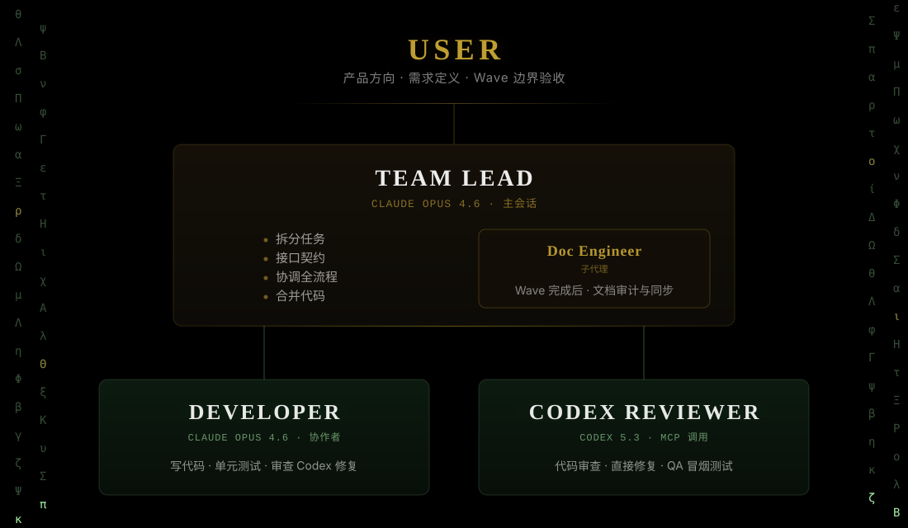

<p align="center">
  
</p>

<p align="center">
  <a href="README.md">English</a>
</p>

---

**iSparto 是一个面向 solopreneur 的开源跨厂商 AI 开发团队,运行在 Claude Code + Codex CLI 之上。** Claude 负责规划、编排,并逐行审查 GPT 实现的代码;一条零继承上下文的 GPT 盲审通道反向独立复核规划与产品是否对齐——两家厂商的工作互相检查。一条命令启动整支团队,你通过 Team Lead 指挥。

> **中文用户第一次使用?** 先看 [docs/zh/quick-start.md](docs/zh/quick-start.md) — 安装、首次使用、日常工作流的中文速览。
>
> iSparto 采用双语策略:用户入口(双语 README + 中文 quick-start + CONTRIBUTING)平行维护;框架指令和参考文档单一英文来源,保证 AI 指令跟随的稳定性,同时让不懂中文的开源贡献者能参与审查。详情见 [CLAUDE.md > Documentation Language Convention](CLAUDE.md#documentation-language-convention)。

> **v0.8.0(2026-04-20 发布)有两处运行时变化。** 自 v0.8.0 起 tmux 3.x 为硬性依赖(Independent Reviewer 通过 `codex exec` 在独立 tmux pane 内启动,不再走 Claude Code sub-agent),同时 Codex CLI 同时服务两个角色(Developer 负责实现 + QA,Independent Reviewer 负责跨厂商盲审)。完整 release notes 见 [CHANGELOG.md](CHANGELOG.md)。

### 核心差异 — 一条命令,整支团队

现有的 AI 编程工具(Cursor、Windsurf、Copilot、单会话的 Claude Code)都让你和一个 Agent 反复交换消息——每一个决策、每一份文件、每一次 commit,整个开发循环都跑在同一个对话窗口里。

iSparto 的核心动作是把这一个 Agent 变成一支 Agent Team。一条命令(`/init-isparto` 或 `/start-isparto`)启动整支 agent team——六个角色并行:Team Lead 拆任务、协调团队,Teammate 并行写代码 prompt,Independent Reviewer 以零上下文独立审查,Developer 通过 Codex 实现代码,Doc Engineer 同步文档,Process Observer 守护工作流。你通过 Team Lead 指挥团队,其余在真正需要决策时才回来。

这支团队刻意横跨两家厂商。单一厂商的 agent 编队共享同一套训练分布,也就共享同一组盲点——让写代码的模型家族自己审自己,审查会继承它本该抓住的失败模式。iSparto 默认把质量路径双向跨过厂商边界:Claude 审查 GPT 写下的代码,零上下文的 GPT 在 Wave 边界反向复核 Claude 的规划与产品规格是否对齐。失败模式彼此独立,审查路径互不隶属。

|  | 单 Agent 工具 | iSparto |
|--|---|---|
| 你看到什么 | Agent 刚读到的所有事实,用散文复述一遍 | 你现在必须知道的那一句,其余留在 `docs/` 里 |
| 什么时候打断你 | 只要 Agent 有话想说 | 只在真正需要决策的时刻 |
| 跨会话状态 | 会丢,每次都得重新解释上下文 | `/start-isparto` 从 `docs/plan.md` 自动恢复 |
| 文档同步 | 手动 | 每个 Wave 边界由 Doc Engineer 审计(Wave 是一组解耦任务的工作批次;详见 [docs/concepts.md](docs/concepts.md#wave-parallelism)) |
| 谁来审查工作 | 写代码的模型自己审 | 对方厂商交叉审——Claude 审 GPT 的代码,零上下文的 GPT 审规划 |

### 跨厂商审查真的抓到过东西吗?

来自本仓库日志的双向实证:

- **GPT 抓住 Claude 的问题** —— Wave 边界上,Independent Reviewer(GPT,零上下文)以两个 MAJOR 发现 BLOCK 了 `scripts/doctor-check.sh` 的合并:`|| true` 掩盖了 version-check 失败,raw 多行输出破坏了 one-line-per-check 契约。三轮循环:BLOCK → 修复 → BLOCK → 修复 → PROCEED。([session log,2026-04-20](docs/session-log.md#2026-04-20-session--wave-2--doctor-slash-command-v080-observation-period-row-3))
- **GPT 抓住所有 Claude 侧扫描都漏掉的问题** —— v0.8.0 边界审查发现 `docs/configuration.md` 里一行过期的 token-budget 配置,Lead 和 Doc Engineer 审计都没拦住。([session log,2026-04-18](docs/session-log.md#2026-04-18-session--v080-model-config-upgrade--independent-reviewer-cross-provider-migration))
- **Claude 抓住 GPT 的问题** —— Lead 复审 Codex 输出时抓出 `git diff --stat` 漏掉 staged 文件(改为 `git diff HEAD --stat`),以及 diff 输出破坏 Markdown 表格渲染。([案例 1](docs/case-studies.md#case-1--session-log-self-bootstrapping-wave-5))

### 适合谁用

在 macOS 上用 Claude Code + Codex CLI 跑一支跨厂商 agent team 的 solopreneur。需要 Claude Max 和 ChatGPT 订阅。

> **平台:仅支持 macOS。** 自 v0.8.0 起,**tmux 3.x 为硬性依赖** —— Independent Reviewer 通过 `codex exec` 在 tmux pane 内启动(在零上下文继承之上叠加跨厂商盲审)。用 `brew install tmux` 安装。单会话模式在其他平台上可能可用,但未经测试。

| 项目 | 要求 | 说明 |
|---|---|---|
| Claude Max 订阅 | $100/月 | 运行 Claude Code 以及 Lead / Teammate / Doc Engineer 角色 |
| ChatGPT 订阅 | $20/月 | 运行两个角色的 Codex CLI:Developer(实现 + QA)和 Independent Reviewer(`codex exec` 在 tmux pane 内,跨厂商盲审) |
| Node.js | 18+ | 运行 Claude Code、Codex CLI 和 MCP Server |
| Git | 任意版本 | 版本控制 |
| 终端 | iTerm2(macOS)+ tmux 3.x | 自 v0.8.0 起 tmux 为硬性依赖(Independent Reviewer 在 tmux pane 内跑 `codex exec`);`brew install tmux` 安装 |

**总成本:$120/月**,两个顶级模型,无额外 API 费用。

---

## 安装

**前置条件:** [Claude Max](https://claude.ai)($100/月)+ [ChatGPT Plus](https://chatgpt.com)($20/月)。iSparto 以 Claude Code 为运行时,Codex CLI 同时给两个角色用:Developer(实现 + QA)和 Independent Reviewer(`codex exec` 在 tmux pane 内)。

```bash
curl -fsSL https://raw.githubusercontent.com/BinaryHB0916/iSparto/main/bootstrap.sh | bash
```

一行搞定:从 GitHub Releases 下载经过校验的安装器、检查/安装 Claude Code 和 Codex CLI、登录 Codex、复制命令和模板到 `~/.claude/`、注册全局 MCP Server。不会修改你现有的 `~/.claude/settings.json`。安装前会自动对原始文件拍快照,随时可以回滚。

**安装前 Dry run(预览):**

```bash
curl -fsSL https://raw.githubusercontent.com/BinaryHB0916/iSparto/main/bootstrap.sh | bash -s -- --dry-run
```

**安装指定版本:**

```bash
curl -fsSL https://raw.githubusercontent.com/BinaryHB0916/iSparto/main/bootstrap.sh | bash -s -- --version=0.8.0
```

**升级:**

```bash
~/.isparto/install.sh --upgrade
```

> 升级只更新框架组件(命令模板、文档模板、快照引擎)。你的项目文件(CLAUDE.md、docs/、代码、配置)不会被修改。

**卸载:** 从备份快照还原所有被修改的文件(离线可用):

```bash
~/.isparto/install.sh --uninstall
```

遇到问题?查看[问题排查](docs/troubleshooting.md)。

<details>
<summary>备选:手动 clone</summary>

```bash
git clone https://github.com/BinaryHB0916/iSparto.git
cd iSparto && ./install.sh              # 或: ./install.sh --dry-run
```
</details>

---

## 快速开始

### 初始化新项目

```bash
mkdir my-app && cd my-app
claude --effort max
/env-isparto                              # 可选,环境检查
/init-isparto 我要做一个xxx            # 生成 CLAUDE.md + docs/ + 架构预审
```

创建文件前会自动拍快照。如果出现问题,运行 `/restore-isparto` 即可回滚。

### 迁移已有项目

```bash
cd existing-project/
claude --effort max
/migrate-isparto --dry-run    # 预览迁移方案,不执行(首次建议先用这个)
/migrate-isparto              # 扫描项目,出迁移方案,保留所有现有内容
```

迁移前会自动拍快照。随时运行 `/restore-isparto` 可回滚。

### 每天的工作循环

```
/start-isparto
    → Lead 读 plan.md,告诉你当前状态和待办
    → 你确认「开始」
        ↓
团队自己跑,你不用盯着
    → 拆任务 → 写代码 → 跨角色审查 → 文档审计
        ↓
只在真正需要决策的时刻 Lead 才回来找你
        ↓
/end-isparto
    → 同步文档 → 更新 plan.md → commit → push
```

### 有新需求时

```
/plan-isparto 我想加一个xxx功能
    → Lead 先审视产品方向,出一个方案
    → 你确认方案后,Lead 把方案写入 plan.md 再开始
```

---

## 角色架构

<p align="center">
  
</p>

Agent Team 有六个角色:

- **Team Lead** —— 你直接对话的角色。拆任务、协调团队,只在真正需要决策时打断你。
- **Teammate** —— 并行的 Claude 会话,承接 Team Lead 分派的工作。在独立的 tmux pane 里运行。
- **Independent Reviewer** —— 在审查时刻以零上下文启动,不会对自己参与过的决定盖章放行。
- **Developer** —— 实现角色,通过 MCP 调用(Codex)。从 Team Lead 接到规格,返回代码。
- **Doc Engineer** —— 在每个 Wave 边界审计文档。
- **Process Observer** —— 一个 PreToolUse hook(shell,无模型),防止仪式步骤被跳过;外加一层 Sonnet 4.6 顾问审计层(每次 /end-isparto 运行合规审查)。

完整的模型分配和推理等级见 [docs/configuration.md](docs/configuration.md#agent-model-configuration)。安全监督(Write/Edit 扫描、commit 前 secret/PII 扫描、`/security-isparto` 里程碑审计)见 [docs/security.md](docs/security.md)。

---

## 案例集

iSparto 自举开发——框架用自己的工作流开发自己。端到端的案例集合有单独的文件:见 [docs/case-studies.md](docs/case-studies.md),从 Session Log 自举案例开始——用工作流给自己搭出了「session 指标自动采集」功能。

## Dogfood Log

每个 Wave 跑完后的主观感受记录在 [docs/dogfood-log.md](docs/dogfood-log.md)——框架是否真的「更安静」、什么时候被打扰、打扰得值不值,都写在那里。它和本页上的价值主张是「pitch + 证据」的关系。

## 仓库结构

完整的仓库目录树和每个文件的注释在 [docs/repo-structure.md](docs/repo-structure.md)。README 不再内嵌目录树,避免每次结构调整都把 README 搅动一次。

---

## 启动清单

**一次性安装(`./install.sh` 自动完成):**

- [ ] Claude Max + ChatGPT 订阅已开通
- [ ] 终端使用 iTerm2(macOS,并行分屏依赖)
- [ ] 安装了 tmux 3.x(自 v0.8.0 起必需;`brew install tmux`)
- [ ] `./install.sh` 已执行(Claude Code、Codex CLI、配置文件、MCP)
- [ ] 多设备同步已配置(如有多台电脑,见 [configuration.md](docs/configuration.md#multi-device-sync-optional))

**每个新项目(`/init-isparto` 自动完成):**

- [ ] `claude --effort max` 启动
- [ ] `/env-isparto` 检查通过(可选)
- [ ] `/init-isparto` 已生成 CLAUDE.md + docs/
- [ ] 项目级 `.claude/settings.json` 配置平台相关插件(可选)

---

## 名字的由来

希腊神话里,英雄 Cadmus 杀了一条龙,把龙牙种进泥土。一支全副武装的战士从地里破土而出——他们被称为 **Spartoi**(Σπαρτοί),意为「播种而生的人」。

这和 iSparto 的工作流是同一个故事:你把产品需求「种」进 `/init-isparto`,一整支团队自动组建——Lead 拆任务、Developer 写代码、同一个 Wave 内完成审查与修复、Doc Engineer 同步文档——从一颗种子长出一支完整的团队。

**i** 从 Spartoi 末尾移到了最前面。小写的 i = I = 我,一个人。

**iSparto = I + Sparto = 一个人,从一颗种子长出的一整支 Agent Team。**

---

## License

[MIT](LICENSE)
