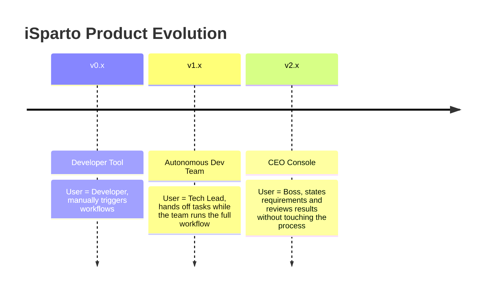

# iSparto Product Specification

## Product Positioning
iSparto is an AI Agent Team workflow framework that turns Claude Code from a single agent into a development team with clearly defined roles.

**One-line vision:** Give everyone their own technical team — talk like a CEO, state requirements, watch progress, receive deliverables, and never touch code or terminals.

**Current stage:** The open-source core workflow has been released and is serving independent developers as a developer tool while undergoing dogfooding validation.

## Product Evolution

iSparto evolves through three stages, each serving a different user role:

### v0.x — Developer Tool (current)
Extends Claude Code from a single agent into a structured team. Users are still developers who understand git/branches/review and trigger workflows via slash commands. Core value: **one person commands the output capacity of an entire team**.

### v1.x — Autonomous Dev Team
Users no longer need to manually drive every workflow node. Saying "build this feature" lets the team complete the full plan → code → review → test → merge loop on its own. The user role shifts from "developer" to "tech lead" — focused on direction and acceptance, not on the process. Core value: **end-to-end autonomy where the user only supplies requirements and validates results**.

### v2.x — CEO Console
Users describe business requirements in natural language; the team translates them into technical tasks, executes, reports progress, and delivers a runnable demo. No technical background required. Core value: **a natural-language interface to a technical team**.

## Target Users

| Stage | User Profile | Core Scenario |
|-------|--------------|---------------|
| v0.x | Independent developers (indie hackers) familiar with Claude Code + Git | Drive parallel team development via slash commands |
| v1.x | Tech leads / full-stack founders | Hand off tasks and review results without supervising the process |
| v2.x | Non-technical founders / CEOs / product managers | Manage an AI development team in natural language |

## Core Features

- **Agent Team role separation**: Team Lead assembles prompts and coordinates, Developer (Codex) implements code, Teammates run in parallel, Doc Engineer keeps documentation in sync
- **Wave-based parallel development**: multiple Developers run in parallel within a single Wave, with tmux split panes for visualization
- **8 slash commands**: /init-project, /migrate, /start-working, /end-working, /plan, /env-nogo, /restore, /security-audit
- **Cross-session state recovery**: driven by plan.md, with /start-working automatically restoring context
- **Cross-model quality gate**: Lead reviews Developer (Codex) output, covering each model's blind spots
- **Automatic documentation sync**: Doc Engineer audits code/documentation consistency every Wave
- **Snapshot/restore**: an automatic snapshot is taken before every operation, and /restore performs one-click rollback
- **Session log**: docs/session-log.md records development metrics for every session
- **Process Observer compliance oversight**: a three-layer security defense — L1 real-time content scanning on Write/Edit (intercepts critical secrets), L2 full secret/PII scan on pre-commit, L3 milestone-level full audit via /security-audit (covering git history and dependency checks). The post-hoc audit checks the full session for compliance against the code of conduct (a 14-item checklist). The Observer does not participate in development decisions, only oversees them; deviation reports are emitted to the session briefing rather than auto-modifying files; remediation suggestions feed back into the rules to form a self-improvement loop
- **Version tracking and changelog**: --upgrade supports version upgrades
- **One-line install**: a single curl command, with --dry-run preview, --upgrade upgrade, and --uninstall uninstall

## Technical Constraints
- Pure configuration project: shell scripts + Markdown templates + MCP server registration
- Depends on Claude Code Agent Team mode (requires Claude Max at $100/month)
- Depends on the Codex CLI (requires ChatGPT at $20/month)
- Depends on iTerm2's tmux integration (macOS only)

## Competitive Differentiation
Other AI coding tools (Cursor, Windsurf, Copilot, single-session Claude Code) all have the user iterating with a single agent. iSparto turns that single agent into an Agent Team — one command spins up the whole agent team, all working in perfect sync. The user only talks to the Team Lead, and the Team Lead coordinates the Teammate, Independent Reviewer, Developer, Doc Engineer, and Process Observer roles in the background.

## Three-Layer Capability Model

Realizing the product evolution requires building three capabilities layer by layer:

### Layer 1: Workflow autonomy (the bridge from v0.x to v1.x)
The team can complete the full plan → code → review → test → merge workflow on its own without requiring user approval at intermediate steps.

- Already delivered in v0.x: Solo + Codex mode, auto PR merge, fully automated end-working, plan.md-driven cross-session continuation, parallel Agent Team read/write
- Gaps: multi-task parallel management (advancing several independent tasks simultaneously), automatic failure retry and rollback

### Layer 2: State visibility (the core of v1.x)
Users do not write code, but they need to know what the team is doing, how far it has progressed, and whether it is stuck.

- Progress summary — status, completion, and blockers per task, reported in plain language
- Demo preview — automatic preview-environment deployment + screenshots + a one-line description of the change
- Risk early warning — proactively reports complexity overruns, dependency issues, and technical risks
- Agent dashboard — a task board that visualizes team work status
- Cost & token analytics — usage statistics that help users understand return on investment

### Layer 3: Requirement understanding (the core of v2.x)
Users speak in business terms and the team translates them into technical tasks.

- Requirement decomposition — business requirement → technical task → priority ordering
- Solution decision — the team proposes technical approaches and the user only confirms direction
- Delivery acceptance — runnable demo + change notes; the user gives feedback after trying it out
