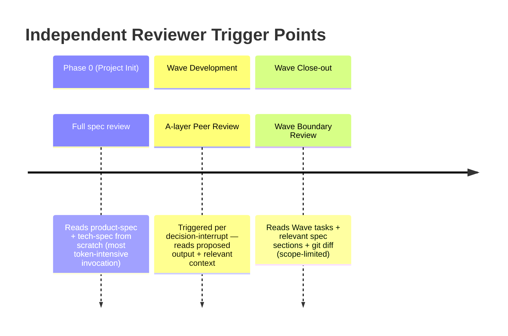

# Complete Development Workflow

## Phase 0: Product Initialization

### Independent Reviewer — Trigger Points across the Wave Lifecycle



```
User describes product requirements
    |
Claude generates product-spec.md + tech-spec.md + design-spec.md (in CLAUDE.md and docs/)
    |
User reviews product direction:
  - Is this really what the user needs?
  - Is there a better solution hidden behind the requirement?
  - What does the 10/10 version look like?
    |
Developer (Codex) reviews technical architecture (Team Lead invokes via MCP, based on tech-spec.md):
  - Architecture fitness and scalability
  - Data flow and state management
  - Potential performance bottlenecks and security issues
  - Whether tech choices match requirements
    |
Independent Reviewer (Codex CLI in tmux pane — GPT-5.4, cross-provider isolation on top of zero inherited context; most token-intensive role per invocation; reads product-spec then tech-spec independently):
  - Product-technical alignment: does tech-spec implement what product-spec describes?
  - Implicit assumptions check: any simplifications that change user-facing behavior?
  - Requirement coverage: any product requirements with no technical approach?
  - Report written directly to docs/independent-review.md
  - CRITICAL finding → BLOCK — resolve before development; after fix, re-trigger reviewer to verify
    |
User confirms (docs + architecture review + independent review) -> enter Wave development
```

## Collaboration Mode Selection

**Wave Parallelism**: Wave-level parallelism requires file ownership plus interface contracts. See [concepts.md](concepts.md) §Wave Parallelism for the full rule.

The Team Lead automatically selects the collaboration mode based on task characteristics. This is transparent to the user — no explicit mode switch is needed.

**Solo + Codex** — Lead completes the task alone. This is the **default mode**.

**Agent Team** — Lead spawns teammates for parallel execution. Upgrade to Agent Team when **both** conditions are met:

| Condition | Question | Examples |
|-----------|----------|----------|
| 1. Decomposable | Can the work be split into independent parallel sub-tasks? (no file overlap, no data dependency) | 2+ features in different modules → yes; sequential steps in one module → no |
| 2. Sufficient volume | Is file count × workload per file large enough to justify coordination overhead? | See examples by task type below |

This applies to both **write** and **read** tasks:

| Task type | Agent Team example | Solo example |
|-----------|-------------------|--------------|
| **Write** (code, docs, config) | 5 files with large logic changes each | 5 files with 1-line edits each |
| **Read** (code review, doc audit, research/debug) | Review spans multiple modules/files → split by module, parallel review | Review covers a few files → serial review |

If either condition is not met, stay in Solo + Codex. The file count "≤ 3" is a quick heuristic, not a hard rule — what matters is whether parallel coordination saves more time than it costs.

### Mode Selection Checkpoint

After plan approval and before starting the first implementation step, the Team Lead **must** explicitly evaluate and declare the collaboration mode. This is a mandatory step, not an optional optimization — skipping it is a process deviation.

**Steps:**
1. **Group files by ownership** — based on the approved plan, identify independent file groups (no overlap, no data dependency between groups)
2. **Evaluate against criteria** — check both conditions: decomposable (≥2 independent groups) AND sufficient volume (total workload justifies coordination)
3. **Declare mode:**
   - **Agent Team** → state the number of Teammates and file ownership for each
   - **Solo + Codex** → state the reason (e.g., "single file group" or "changes too small to parallelize")

**Why this is mandatory:** Without an explicit checkpoint, the Lead defaults to Solo out of inertia — even when the plan clearly shows independent file groups that could be parallelized. The checkpoint forces a conscious decision at the plan→execution boundary.

**Shared across both modes** (no difference):
- Developer invocation / QA → triggered per the Developer Trigger Conditions table below
- Doc Engineer documentation audit → always the final step
- Branching → feat/fix/hotfix branches, never develop on main
- Merge → after full workflow, Lead auto-creates PR and merges to main (no manual user review needed — Codex review during development is the quality gate)

## Phase 1-N: Wave Development

### Solo + Codex Workflow

```
Branch guard: verify not on main, checkout -b if needed (see Branch Protocol in CLAUDE.md)
    |
Team Lead reads plan.md, confirms current Wave
    |
MODE SELECTION CHECKPOINT:
  - Group files by ownership from the plan
  - Evaluate: decomposable? sufficient volume?
  - Declare: "Solo — reason: [why not Agent Team]"
    |
Lead assembles implementation prompt → calls Developer (Codex) via MCP
  (Implementation Protocol: see CLAUDE.md → Collaboration Mode section)
  - Developer implements the task
  - Developer writes unit tests for core logic
    |
Lead reviews Developer output
  - Confirms implementation is correct
  - If issues found: assembles fix prompt → calls Developer again → reviews
    |
Lead assembles QA prompt → calls Developer for smoke testing (using acceptance script from plan.md, per trigger table)
  - Developer MUST build the project first (using build command from CLAUDE.md)
  - Executes acceptance script action/eval steps as the minimum test coverage
  - Each eval step verified at its tagged level: [code] by analysis, [build] by checking artifacts, [runtime] by actually running the app
  - "Looks correct from code" is NOT valid evidence for [build] or [runtime] steps
  - **Carve-out (trivial CLI acceptance):** When the plan.md acceptance script consists of ≤5 deterministic bash commands whose verdict is determined solely by exit code (e.g., `bash scripts/language-check.sh --self-test`), Lead may execute them directly and record each command + exit code in plan.md as acceptance evidence, skipping the Developer QA wrapper. Requires: no build step, no runtime app verification, no output-parsing. Does NOT apply to multi-step scripts, scripts needing log interpretation, or any step tagged [build]/[runtime].
    |
(If Phase 0, or Wave completed)
Independent Reviewer (Codex CLI in tmux pane — GPT-5.4, cross-provider isolation on top of zero inherited context):
  - Spawned with fixed one-liner: `codex exec "You are the Independent Reviewer. Read agents/independent-reviewer.md and execute. Write your findings to docs/independent-review.md."`
  - Verifies product-spec ↔ implementation alignment for this Wave's scope
  - CRITICAL finding → stop, resolve alignment before proceeding; after fix, re-trigger reviewer
  - Report written to docs/independent-review.md (Phase 0: overwrite; Wave boundary: append with date header)
  - **Wave-boundary skip carve-out:** at Wave boundary only (not Phase 0), the IR invocation may be skipped under the three-condition carve-out in `commands/end-working.md` Step 3 — no application-code files modified, no new product-behavior surface, Doc Engineer + Process Observer sub-agent audits both running in this `/end-working` invocation. Skip requires a one-line rationale in the Wave entry. Default on doubt: run IR.
    |
Team Lead runs Doc Engineer audit (as sub-agent)
  - Same checklist as Agent Team mode (see Doc Engineer role in roles.md)
    |
Process Observer compliance audit (as sub-agent)
  - Branch convention check (A1-A3)
  - Developer invocation compliance check (B1-B4)
  - Doc Engineer compliance check (C1-C4)
  - PR workflow compliance check (D1-D2)
  - Ownership violation check (E1-E2)
  - Outputs deviation report to session briefing
    |
Team Lead pushes branch -> creates PR -> merges to main -> cleans up branch
```

### Agent Team Workflow

```
Branch guard: verify not on main, checkout -b if needed (see Branch Protocol in CLAUDE.md)
    |
Team Lead reads plan.md, confirms current Wave
    |
MODE SELECTION CHECKPOINT:
  - Group files by ownership from the plan
  - Evaluate: decomposable? sufficient volume?
  - Declare: "Agent Team — N teammates, ownership: [groups]"
    |
Team Lead breaks down tasks: defines file ownership + prompt scope for each Teammate
    |
Teammate(s) execute in parallel, each independently:
  - Assembles implementation prompt → calls Developer (Codex) via MCP
    (Implementation Protocol: see CLAUDE.md → Collaboration Mode section)
  - Reviews Developer output
  - If issues: assembles fix prompt → calls Developer again → reviews
    |
Lead assembles QA prompt → calls Developer for smoke testing (using acceptance script from plan.md, incremental, wave-scoped)
  - Developer MUST build the project first (using build command from CLAUDE.md)
  - Executes acceptance script action/eval steps as the minimum test coverage
  - Each eval step verified at its tagged level: [code] by analysis, [build] by checking artifacts, [runtime] by actually running the app
  - "Looks correct from code" is NOT valid evidence for [build] or [runtime] steps
  - Identifies the change scope of this Wave, only tests feature paths affected by changes
  - Skips areas tested in previous Waves that are not affected by current changes
  - Runs the app and verifies key user operation paths at runtime (not just code simulation)
  - Records and directly fixes issues found
  - **Carve-out (trivial CLI acceptance):** When the plan.md acceptance script consists of ≤5 deterministic bash commands whose verdict is determined solely by exit code (e.g., `bash scripts/language-check.sh --self-test`), Lead may execute them directly and record each command + exit code in plan.md as acceptance evidence, skipping the Developer QA wrapper. Requires: no build step, no runtime app verification, no output-parsing. Does NOT apply to multi-step scripts, scripts needing log interpretation, or any step tagged [build]/[runtime].
    |
(If Phase 0, or Wave completed)
Independent Reviewer (Codex CLI in tmux pane — GPT-5.4, cross-provider isolation on top of zero inherited context):
  - Spawned with fixed one-liner: `codex exec "You are the Independent Reviewer. Read agents/independent-reviewer.md and execute. Write your findings to docs/independent-review.md."`
  - Verifies product-spec ↔ implementation alignment for this Wave's scope
  - CRITICAL finding → stop, resolve alignment before proceeding; after fix, re-trigger reviewer
  - Report written to docs/independent-review.md (Phase 0: overwrite; Wave boundary: append with date header)
  - **Wave-boundary skip carve-out:** at Wave boundary only (not Phase 0), the IR invocation may be skipped under the three-condition carve-out in `commands/end-working.md` Step 3 — no application-code files modified, no new product-behavior surface, Doc Engineer + Process Observer sub-agent audits both running in this `/end-working` invocation. Skip requires a one-line rationale in the Wave entry. Default on doubt: run IR.
    |
Team Lead spawns Doc Engineer (sub-agent) for documentation audit (placed last to ensure QA-fixed code is also audited)
  - Code vs product-spec.md consistency
  - Code vs tech-spec.md consistency
  - plan.md task status update
  - design-spec.md vs actual styles consistency
  - Whether CLAUDE.md module boundaries need updating
  - Product terminology consistency across all docs (command counts, feature names match, no internal API terms in user-facing docs)
  - Product narrative integration: do new features fit coherently into the overall product story (README, product-spec, Quick Start, troubleshooting) — audit from the user's perspective, not just the changed files
    |
Process Observer compliance audit (as sub-agent, after Doc Engineer)
  - Branch convention check (A1-A3)
  - Developer invocation compliance check (B1-B4)
  - Doc Engineer compliance check (C1-C4)
  - PR workflow compliance check (D1-D2)
  - Ownership violation check (E1-E2)
  - Outputs deviation report to session briefing
    |
Team Lead pushes branch -> creates PR -> merges to main -> cleans up branch
```

## Developer Trigger Conditions

**Default: trigger implementation + QA.** Only skip for changes explicitly listed in the "QA only" or "Skip" tiers below. When in doubt, trigger.

### Tier 1: Implementation + QA (default — everything not in Tier 2 or 3)

All code changes trigger both implementation and QA unless they fall entirely within Tier 2 or Tier 3. This includes but is not limited to:

| Category | Examples |
|----------|----------|
| Cross-layer interaction | System calls, threading, IPC, language bridging (C/Swift, JNI), build configuration |
| Business logic | State management, data flow, conditional branching, error handling paths |
| Data layer | Model definitions, schema changes, persistence logic, migrations |
| API / networking | Request construction, response parsing, authentication flows |
| Navigation / routing | Page transitions, deep links, URL schemes |
| Dependencies | Adding, removing, or updating packages (SPM, npm, pip, etc.) |
| Permissions / security | Entitlements, Info.plist, credentials handling, encryption |
| Infrastructure | CI/CD pipelines, deployment config, install/upgrade scripts |

> **Model selection:** Tier 1 implementation steps use the Developer default model (gpt-5.4, xhigh); QA steps and Tier 2 use gpt-5.4-mini (high). See docs/configuration.md "Developer tiered model strategy" for details.

### Tier 2: Partial review

#### Tier 2a: QA only (no implementation review needed)

| Category | Examples |
|----------|----------|
| Pure visual | Colors, fonts, layout constants, animation parameters, copy text (literal string replacement only — type changes like `LocalizedStringKey` vs `String`, locale API parameters, and string routing logic are Tier 1) |
| Config value tweaks | Non-security config changes (timeouts, feature flags, display limits) |

#### Tier 2b: Developer review only (no QA needed)

| Category | Examples |
|----------|----------|
| Behavioral templates | `commands/*.md` and `templates/*.md` — system prompts that drive AI agent behavior. These iterate frequently (prompt engineering); Developer reviews for correctness, but QA smoke testing is not applicable to prompt wording |

### Tier 3: Skip (neither code review nor QA)

| Category | Examples |
|----------|----------|
| Pure documentation | Markdown files, comments, READMEs — with zero code changes. **Excludes** behavioral templates (`commands/*.md`, `templates/*.md`) — see Tier 2b |
| Formatting only | Whitespace, indentation, linter auto-fixes — with zero logic changes |

### Wave-level safety net

Each Wave must include at least one batch Developer review before completion, regardless of how individual changes are categorized (**except when the entire Wave change set falls within the self-referential boundary defined in CLAUDE.md Development Rules — markdown-only, data-only, no Tier 1 logic changes — in which case Developer is exempted per the Implementation Protocol exception in CLAUDE.md**). Do not defer all reviews to the delivery checkpoint — review at Wave boundaries to catch issues early.

> **Behavioral templates are not documentation.** Files in `commands/*.md` and `templates/*.md` are system prompts that define AI agent behavior — they are executable definitions, not passive documentation. The `.md` extension does not make them Tier 3. Changes go through Tier 2b (Developer review, no QA).

---

## Custom Commands (commands/)

> For the full content of each command, see the source files in the `commands/` directory. Below is a summary of each command's responsibilities.

| Command | Source File | Execution Role | Responsibility |
|---------|-------------|----------------|----------------|
| `/start-working` | [commands/start-working.md](../commands/start-working.md) | Team Lead | Report current status (Wave progress, remaining issues, session history), suggest next step; user reviews briefing and responds naturally |
| `/end-working` | [commands/end-working.md](../commands/end-working.md) | Team Lead | Ensure all changes are persisted, update plan.md, generate session report, auto commit + PR merge, output session briefing |
| `/plan` | [commands/plan.md](../commands/plan.md) | Team Lead | Review product direction, output implementation plan (with decoupling analysis), wait for user confirmation before writing to plan.md |
| `/init-project` | [commands/init-project.md](../commands/init-project.md) | Team Lead | Generate project skeleton and documentation system (CLAUDE.md + docs/), Codex architecture pre-review, prepare for Wave development |
| `/env-nogo` | [commands/env-nogo.md](../commands/env-nogo.md) | Setup Assistant* | Check whether global and project environments meet iSparto runtime requirements |
| `/migrate` | [commands/migrate.md](../commands/migrate.md) | Setup Assistant* | Migrate an existing project to iSparto workflow — scan, propose, execute after confirmation. Supports `--dry-run` to preview only |
| `/restore` | [commands/restore.md](../commands/restore.md) | Setup Assistant* | Restore project to a previous snapshot — list snapshots, preview changes, execute after confirmation |

\* **Setup Assistant** is not a separate role — it is the Team Lead acting in a setup/maintenance capacity. These commands use a distinct persona to clearly separate setup operations from development workflow.

---

## Branching Strategy

```
main              <- Stable version, releases are made from here
  +-- feat/xxx    <- New feature development, merged back to main when complete
  +-- fix/xxx     <- General bug fixes, merged back to main when complete
  +-- hotfix/xxx  <- Urgent production fixes, branched from main, merged back to main when fixed
  +-- release/vX.Y.Z <- Release preparation branch (if needed)
```

**Rules:**
- No direct development on main — it is locked to the current release version
- Each Wave corresponds to a feature branch (e.g., `feat/wave-1-auth`)
- Within a Wave (Agent Team mode), the Team Lead breaks tasks into decoupled sub-tasks, and each Developer works in an isolated working directory via git worktree for parallel development (automatically managed by Claude Code Agent Team, no manual operation needed), relying on file ownership to prevent conflicts
- Minor fixes can be quickly merged back on fix/ branches
- After the full workflow completes (Codex review + Doc Engineer audit), Lead auto-creates PR and merges to main — no manual user review needed

**Merge workflow (both modes):**
1. Lead pushes the feature/fix/hotfix branch
2. If `gh` CLI is available: create PR via `gh pr create`, merge via `gh pr merge --merge`
3. If `gh` CLI is NOT available: push the branch and inform the user to create and merge the PR manually on GitHub
4. Lead deletes the branch (local + remote) and switches back to main

Note: Auto PR merge only happens when all tasks on the current branch are complete (all reviews passed, docs updated). If work is mid-Wave, the branch is pushed but not merged — the PR will be created when the branch is done.

**Hotfix Workflow:**
- Branch hotfix/xxx from main
- The mode selection table applies: simple single-file hotfixes use Solo + Codex; complex hotfixes use Agent Team
- The trigger condition table auto-adapts: Tier 2 changes (pure visual, non-security config tweaks) need QA only; Tier 3 changes (pure doc/formatting) skip both; all other code fixes trigger code review + QA per default
- **Doc Engineer audit still applies** to hotfix/ branches (Solo + Agent Team workflow step 4 requirement). Two narrow substitute/skip paths:
  - **Emergency hotfix substitute path:** when the hotfix/ branch contains ≤3 changed files limited to Tier 1 shell scripts (`*.sh`) and/or `CHANGELOG.md`, AND the session is an explicit emergency release window (e.g., a broken release actively blocking users), Lead may substitute Doc Engineer with (a) `bash scripts/language-check.sh` clean run, (b) manual inline review of each changed file, (c) an explicit session-log entry naming the exception. Any hotfix that does not meet all three conditions must run the standard Doc Engineer audit.
  - **Ad-hoc fix skip path:** if the fix session does not complete any Wave AND the changes have no code↔documentation sync risk (bug fix not corresponding to any plan.md entry), Doc Engineer may be skipped entirely; record the skip in the session briefing.
- After fixing, merge back to main via PR; if there are in-progress feat/ branches, sync the hotfix changes

---

## Developer (Codex) Integration

**Developer Prompt Templates**: Lead assembles Developer prompts with plan anchors and file ownership scope. See [roles.md](roles.md) §Developer (Codex MCP Call) for the full templates.

Model configuration: see [configuration.md](configuration.md) §Agent Model Configuration.

Developer intervenes in three scenarios:

| Scenario | Timing | Details |
|----------|--------|---------|
| A. Architecture pre-review | Phase 0, after product initialization, before development | roles.md → Developer → Architecture pre-review prompt template |
| B. Implementation | Phase 1-N, Lead/Teammate assembles prompt | roles.md → Developer → Implementation prompt template |
| C. QA smoke testing | Phase 1-N, Lead orchestrates after implementation review | roles.md → Developer → QA smoke testing prompt template |

---

## Process Observer Integration

Process Observer is integrated into the workflow at two layers:

### Hooks configuration (real-time interception)

Implemented via the Claude Code PreToolUse hook. The hook script is triggered before every tool invocation, checking whether the command matches the dangerous-operations list (git push --force, direct commit to main, sensitive file leaks, etc.). On a match, execution is blocked and the reason is output.

Hook configuration and the dangerous-operations list are documented in [docs/process-observer.md -> Real-time Interception](process-observer.md#real-time-interception-hooks).

### Post-hoc audit trigger

During the /end-working flow, **after the Doc Engineer documentation audit and before pushing the branch / creating the PR**, the Team Lead spawns a Process Observer sub-agent to run a compliance audit. The audit produces a deviation report against 5 checklists (14 checks total).

The audit report is written to the session briefing and does not modify files automatically. On the next /start-working, the Lead reminds the user about the previous session's deviations in the briefing.

The full audit checklists and deviation report template are documented in [docs/process-observer.md -> Post-Hoc Audit](process-observer.md#post-hoc-audit-sub-agent).
